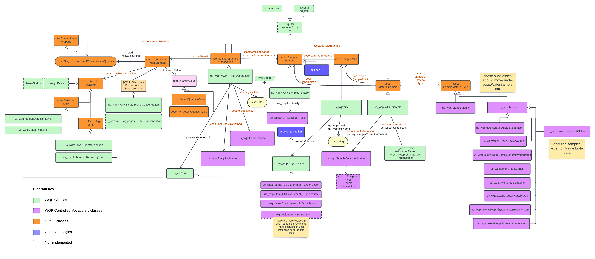

## Overview of the raw dataset

* **Name of dataset:** WQP water-quality data
* **Source Agency:** [NATIONAL WATER QUALITY MONITORING COUNCIL](https://www.waterqualitydata.us/#advanced=true)
* **Data source location:** <https://www.waterqualitydata.us/#advanced=true>
* **Metadata description:** [Data user manual](https://www.waterqualitydata.us/portal_userguide/#location-parameters)
* **Other metadata (for PFAS):** [Water Quality eXchange (WQX) data elements (provided by EPA)](https://www.epa.gov/waterdata/storage-and-retrieval-and-water-quality-exchange-domain-services-and-downloads)
* **Format of data returned:** Excel (converted to cvs for easy data triplification)
* **Data update interval:** ??
* **Volume of raw data**: ??
* **General comments**: We only include a subset of attributes of the output json in AIKnowsPFAS (see mapping tables below).

## Code

* [Code Directory](../../code/water-quality-data-portal)
* [GDrive Output Directory](https://drive.google.com/drive/folders/18HynzQhZStMQj-CuM2U0NUtLUdBybWEx)

## Raw Data Attribute List and Mapping with Ontology Concepts (2.0 schema)

| Site/Station data attribute | Description | Lift to graph | Ontology property |
| --- | --- | --- |--- |
| OrganizationIdentifier | | Yes | Have to decide |
| MonitoringLocationIdentifier | | Yes | egad_siteNumber |
| MonitoringLocationName | | Yes | egad_siteName |
| MonitoringLocationTypeName | | es | |
| HUCEightDigitCode | | Yes | |
| LatitudeMeasure | Site latitude | Yes | geo:Geometry; sf:Point |
| LongitudeMeasure | Site longitude | Yes | geo:Geometry; sf:Point |
| CountyCode | | Yes | |
| ProviderName | Sample number[^1] | Yes | egad_samplePointNumber |

## RAW Data results 3.0 schema (only populated columns)

General schema definitions: from [Glossary](https://cdx.epa.gov/WQXWeb/StaticPages/GlossaryWqx.htm#Project)

* *Activity* - A general term for a field sampling event that produces one or more Result or Metric.  In WQX, an Activity tracks the location, date, and time of the sample or field measurement, as well as the equipment and methods used to collect, transport and store the sample.
* *Project* - Typically refers to a water monitoring project with specific objectives and procedures.  However, in WQX Web, a project is an entity created to group monitoring data for a variety of reasons.  A project may represent an actual monitoring project, a source of funding (or program), or a department or group within the organization who is interested in a specific set of data.
* *Organization* - A state, tribe, volunteer monitoring group, or other public/private organization that manages water monitoring data.
A physical organization may have multiple Organization records in WQX.  For example, a state or tribe may choose to have separate Organizations [in WQX] for their beach monitoring program and their other monitoring programs.  In WQX, an Organization is the entity that is the parent of all other entities (e.g. Projects, Monitoring Locations, Activities, etc.).  Each Organization has a unique ID (which is approved by the EPA).  Likewise, a user must be assigned rights to an Organization before he/she is allowed to import data belonging to it.
* *Location / MonitoringLocation* - Also known as a site or station.  This is the location (on a water body) where samples or field measurements and observations are collected.

| Site/Station data attribute | Description | Lift to graph | Ontology property |
| --- | --- | --- |--- |
| Org_Identifier | A designator used to uniquely identify a unique business establishment within a context. | Yes | us_wqp:Site us_wqp:ofOrganization prov:Organization (with WQP specific subclasses)
| Org_FormalName | The legal designator (i.e. formal name) of an organization. | Yes | prov:Organization rdfs:label
| Project_Identifier| A designator used to uniquely identify a data collection project within a context of an organization. | Yes | us_wqp:WQP-Activity us_wqp:hasProjectId us_wqp:Project
| Project_Name | The name assigned by the Organization (project leader or principal investigator) to the project.| us_wqp:Project rdfs:label
| Project_QAPPApproved |
| Project_QAPPApprovalAgency
| Location_Identifier | A designator used to describe the unique name, number, or code assigned to identify the monitoring location. | Yes | |
| Location_Name
| Location_Type
| Location_Description
| Location_State
| Location_CountryName
| Location_CountyName
| Location_CountryCode
| Location_StatePostalCode
| Location_CountyCode
| Location_HUCEightDigitCode
| Location_HUCTwelveDigitCode
| Location_Latitude
| Location_Longitude
| Location_HorzCoordReferenceSystemDatum
| Location_LatitudeStandardized
| Location_LongitudeStandardized
| Location_HorzCoordStandardizedDatum
| AlternateLocation_IdentifierCount
| Activity_ActivityIdentifier | Designator that uniquely identifies an activity within an organization. | Yes | |
| Activity_ActivityIdentifierUserSupplied | User Supplied designator that uniquely identifies an activity within an organization.. *not used by any state agencies in sample of ME* | | |
| Activity_TypeCode | The text describing the type of activity. (Routine or QC sample) |
| Activity_Media | Name or code indicating the environmental medium where the sample was taken. |
| ActivityBiological_AssemblageSampled | An association of interacting populations of organisms in a given waterbody.(Fish/Nekton)|
| Activity_ConductingOrganization
| Activity_Comment | General comments concerning the activity. (EGAD identifier and species info)
| ActivityLocation_Latitude  |
| ActivityLocation_Longitude |
| Activity_StartDate |
| Activity_StartTime |
| Activity_StartTimeZone |
| SampleCollectionMethod_Identifier | The identification number or code assigned by the method publisher. |
| SampleCollectionMethod_IdentifierContext | Identifies the source or data system that created or defined the identifier. | |
| SampleCollectionMethod_Name | The title that appears on the method from the method publisher. |
| SampleCollectionMethod_QualifierTypeName | Identifier of type of method that identifies it as reference, equivalent, or other. (appears to be mostly redundant with identifierContext) | No |
| SampleCollectionMethod_Description | A brief summary that provides general information about the method. |
| SampleCollectionMethod_EquipmentName
| SampleCollectionMethod_EquipmentComment
| Activity_HydrologicCondition
| Activity_HydrologicEvent
| Result_ResultDetectionCondition
| Result_Characteristic
| Result_CharacteristicUserSupplied
| Result_CASNumber|
| Result_SampleFraction
| ResultBiological_Taxon
| ResultBiological_SampleTissueAnatomy
| Result_MeasureIdentifier
| Result_Measure
| Result_MeasureUnit
| Result_MeasureStatusIdentifier
| Result_MeasureType
| Result_WeightBasis
| DataQuality_ResultComment
| DetectionLimit_TypeA
| DetectionLimit_MeasureA
| DetectionLimit_MeasureUnitA
| DetectionLimit_CommentA
| DetectionLimit_TypeB
| DetectionLimit_MeasureB
| Result_MeasureType
| Result_WeightBasis
| DataQuality_ResultComment
| DetectionLimit_TypeA
| DetectionLimit_MeasureA
| DetectionLimit_MeasureUnitA
| DetectionLimit_CommentA
| DetectionLimit_TypeB
| DetectionLimit_MeasureB
| DetectionLimit_TypeA
| DetectionLimit_MeasureA
| DetectionLimit_MeasureUnitA
| DetectionLimit_CommentA
| DetectionLimit_TypeB
| DetectionLimit_MeasureB
| DetectionLimit_MeasureUnitA
| DetectionLimit_CommentA
| DetectionLimit_TypeB
| DetectionLimit_MeasureB
| DetectionLimit_CommentA
| DetectionLimit_TypeB
| DetectionLimit_MeasureB
| DetectionLimit_TypeB
| DetectionLimit_MeasureB
| DetectionLimit_MeasureB
| DetectionLimit_MeasureUnitB
| DetectionLimit_MeasureUnitB
| DetectionLimit_CommentB
| ResultAnalyticalMethod_Identifier
| ResultAnalyticalMethod_IdentifierContext
| ResultAnalyticalMethod_Name
| ResultAnalyticalMethod_Description
| LabInfo_Name
| LabInfo_AnalysisStartDate
| LabInfo_AnalysisStartTime
| LabInfo_AnalysisStartTimeZone
| LabInfo_LaboratoryComment
| ProviderName
| Result_CharacteristicComparable
| Result_CharacteristicGroup
| Org_Type
| LastChangeDate
| USGSpcode

## Schema Diagram

[WIP Schema Diagram](https://lucid.app/lucidchart/16e658ef-6f61-4ce3-a770-0c410ecb194a/edit?viewport_loc=-1421%2C149%2C3359%2C1620%2C0MKUwZHd6e-j&invitationId=inv_ea094a2c-59da-4347-b175-700b91e5623d)

**Legend description:**

* Green boxes - classes specific for *WQP* dataset.
* Orange boxes - classes in the generic PFAS schema
* Blue boxes - classes from external standard ontologies (e.g., SOSA, GeoSPARQL, OWL-Time, PROV)
* Purple boxes - classes specific for *egad-maine-sample* dataset that are also controlled vocabularies
* Dark grey boes - the controlled vocabularies presented as examples from the EGAD lookup tables
* triangle arrow - subclass relation
* arrow with unfilled ends and a short line - instance (rdf:type) relation

## Sample Data

## Competency Questions

## Contributors

* [Shirly Stephen](https://github.com/shirlysteph)
* [Katrina Schweikert](https://github.com/kschweikert)
