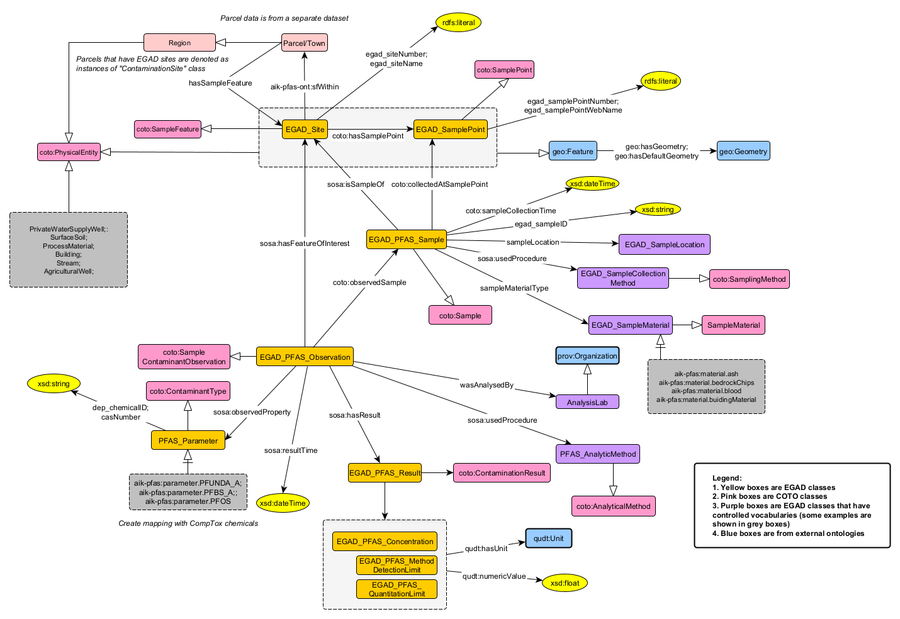

## Overview of the raw dataset
* **Name of dataset:** EGAD PFAS sites and samples
* **Source Agency:** [EGAD](https://www.maine.gov/dep/maps-data/egad/)
* **Data source location:** ??
* **Metadata description:** [Data user manual](https://www.maine.gov/dep/maps-data/egad/documents/Maine%20DEP%20EGAD%20EDD%20v6.0%20User%20Manual_2022%20(Final).pdf)
* **Other metadata (for PFAS):** [EGAD lookup tables)](https://www.maine.gov/dep/maps-data/egad/documents/EGAD_Lookup_Tables.xlsx)
* **Format of data returned:** ??
* **Data update interval:** ?? 
* **General comments**: We only include a subset of attributes of the output json in SAWGraph (see mapping tables below).

##Schema Diagram
[**Link to schema diagram on lucid chart**](https://lucid.app/lucidchart/a9330f5f-14bb-430b-b734-dd37626284e7/edit?viewport_loc=-805%2C-12%2C2587%2C1150%2C0_0&invitationId=inv_9a3f9eda-0d3a-4243-a695-481a17d294b8)

## Code
* [Code Directory](../../code/egad-maine-samples)
* [GDrive Output Directory](https://drive.google.com/drive/folders/18HynzQhZStMQj-CuM2U0NUtLUdBybWEx)

## Raw Data Attribute List and Mapping with Ontology Concepts
| Sheet 2 attribute | Description | Lift to graph | Ontology property |
| --- | --- | --- |--- |
| MCD | Administrative region | Yes | Have to decide |
| SITE_NUMBER | Site number | Yes | egad_siteNumber |
| SITE_NAME | Site name | Yes | egad_siteName |
| SITE_UTM_X | | No | |
| SITE_UTM_Y | | No | |
| SITE_LATITUDE | Site latitude | Yes | geo:Geometry; sf:Point |
| SITE_LONGITUDE | Site longitude | Yes | geo:Geometry; sf:Point |
| PWSID_NO | | No | |
| SAMPLE_POINT_NUMBER | Sample number[^1] | Yes | egad_samplePointNumber |
| SAMPLE_POINT_WEB_NAME | Sample name | Yes | egad_samplePointWebName |
| SAMPLE_POINT_TYPE | Type of sampled point (see List 1) | Yes | rdf:type |
| SP_X | | No | |
| SP_Y | | No | |
| SAMPLE_POINT_LATITUDE | Sampled latitude | Yes | geo:Geometry; sf:Point |
| SAMPLE_POINT_LONGITUDE | Sampled longitude | Yes | geo:Geometry; sf:Point |

[^1]: SAMPLE_POINT_NAME is a DEP defined ID used in uploading and storing data in EGAD. It is important that this ID be exact and consistent. It is a location identifier, not a sample ID. In contrast, SAMPLE_ID is an all-purpose identifier field that can vary from sample to sample and event to event. Samplers, labs, consultants, etc. are free to use the SAMPLE_ID field as they choose, or as defined on a chain of custody form. For many DEP projects/sample events, the Sample Point Name and the Sample ID will be the same, but it does not have to be. 
 

| Sheet 3 attribute | Description | Lift to graph | Ontology property |
| --- | --- | --- | --- |
| SAMPLE_POINT_NUMBER | Sample number[^1] | Yes | egad_samplePointNumber |
| SAMPLE_POINT_WEB_NAME | Sample name | Yes | egad_samplePointWebName |
| SAMPLE_POINT_TYPE | Type of sampled point (see List 1) | Yes | rdf:type |
| ANALYSIS_LAB | | Yes | wasAnalysedBy |
| SAMPLE_ID | Sample ID | No | egad_sampleID |
| ANALYSIS_LAB_SAMPLE_ID | | No | |
| QC_TYPE | | No | |
| RESULT_TYPE | | No | |
| SAMPLE_TYPE | Type of sample (see List 2) | No | |
| SAMPLE_TYPE_UPDATE | Updated type of sample | Yes | egad_sampleID |
| SAMPLED_BY | Person who sampled | No | |
| SAMPLE_DATE | Date of sampling | Yes | prov:atTime |
| CAS_NO | | No | |
| PARAMETER_NAME | Type of chemical detected/sampled (see List 3) | Yes | sosa:observedProperty |   
| PARAMETER_SHORTENED | Abbreviated chemical name | Yes | sosa:observedProperty |
| CONCENTRATION | Concentrationo of chemical | Yes | egad_pfas_concentration |
| PARAMETER_UNITS | Units of measured chemical | Yes | appended with measurment |
| LAB_QUALIFIER | | No | |
| VALIDATION QUALIFIER | | No | |
| VALIDATION_LEVEL | | No | |
| QUANTITATION_LIMIT | | Yes | egad_pfas_ql |
| TEST_METHOD | | No | |
| PARAMETER_QUALIFIER | | No | |
| PARAMETER_FILTERED | | No | |
| SAMPLE_COLLECTION_METHOD | Sampling method (see table 4) | Yes | sosa:madeBySampler |
| SAMPLE_LOCATION | | Yes | sampleLocation |
| TREATMENT_STATUS | | ?? | |
| MDL | Method Detection Limit | Yes | egad_pfas_mdl |
| ANALYSIS_DATE | | Yes | sosa:ResultTime |
| PREP_METHOD | | ?? | |
| PREP_METHOD2 | | ?? | |
| DILUTION_FACTOR | | ?? | |
| WEIGHT_BASIS | | ?? | |
| BATCH_ID | | ?? | |
| SAMPLE_DELIVERY_GROUP | | ?? | |
| DEPTH | | ?? | |
| DEPTH_UNITS | | ?? | |
| SAMPLE_COMMENT | | ?? | |
| PARAMETER_SEQ | | ?? | |

**Notes on the data:**
- Site and Sample Point have 1:n relationship
- Sample Point and Sample have 1:n relationship
- Sample and PFAS_Parameter have 1:n relationship (therefore sample and result have 1:n relationship)
- Sample time and analysis time are very different (which is why we disinguish them using two temporal properties)

## Schema Diagram


**Legend description:**
- Yellow boxes - classes specific for _egad-maine-sample_ dataset.
- Pink boxes - classes in the generic PFAS schema
- Blue boxes - classes from external standard ontologies (e.g., SOSA, GeoSPARQL, OWL-Time, PROV)
- Purple boxes - classes specific for _egad-maine-sample_ dataset that are also controlled vocabularies
- Dark grey boes - the controlled vocabularies presented as examples from the EGAD lookup tables
- arrow with filled ends - object/data properties
- arrow with unfilled ends - subclass relation
- arrow with unfilled ends and a short line - instance (rdf:type) relation

## Controlled Vocabularies (EGAD Lookup Tables)
- [List 1. Analysis Labs](https://github.com/shirlysteph/AlKnowsPFAS/blob/main/data/egad-maine-samples/Metadata/analysis_lab.csv)
- [List 2. PFAS Parameters](https://github.com/shirlysteph/AlKnowsPFAS/blob/main/data/egad-maine-samples/Metadata/pfas_parameter.csv)
- [List 3. Sample Collection Methods](https://github.com/shirlysteph/AlKnowsPFAS/blob/main/data/egad-maine-samples/Metadata/sample_collection_method.csv)
- [List 4. Sample Locations](https://github.com/shirlysteph/AlKnowsPFAS/blob/main/data/egad-maine-samples/Metadata/sample_location.csv)
- [List 5. Sample Point Types](https://github.com/shirlysteph/AlKnowsPFAS/blob/main/data/egad-maine-samples/Metadata/sample_point_type.csv)
- [List 6. Site Types](https://github.com/shirlysteph/AlKnowsPFAS/blob/main/data/egad-maine-samples/Metadata/sample_type.csv)
- [List 4. Sample Material Types](https://github.com/shirlysteph/AlKnowsPFAS/blob/main/data/egad-maine-samples/Metadata/sample_type.csv)

**Notes(changes that I made to the Lookup Tables so they were comprehensive with the PFAS data):**
1. Added the following two records to List 1:
	 - CONTEST ANALYTICAL LABORATORY- EAST LONGMEADOW, MA (Value: CON)
	 - COLUMBIA ANALYTICAL- KELSO, WA (Value: COL)
2. Changed spelling of 'Fillet' in List 4 to 'Filet'
3. Added DRINKING WATER in List 4 (VALUE: DW)

## Sample Data

EGAD site and its geometry
```
aik-pfas:egad.site.29410 a aik-pfas-ont:EGAD_Site ;
    rdfs:label "EGAD site with site number 29410" ;
    aik-pfas-ont:egad_siteName "UNITY LANDFILL"^^xsd:string ;
    aik-pfas-ont:egad_siteNumber 29410 ;
    geo:hasDefaultGeometry aik-pfas:egad.site.geometry.29410 ;
    geo:hasGeometry aik-pfas:egad.site.geometry.29410 .

aik-pfas:egad.site.geometry.29410 a geo:Geometry,
        sf:Point ;
    geo:asWKT "POINT (-69.2923093 44.5873933)"^^geo:wktLiteral .
```
EGAD sample point and its geometry
```
aik-pfas:egad.samplePoint.100410 a aik-pfas-ont:EGAD_SamplePoint,
        aik-pfas-ont:MW ;
    aik-pfas-ont:locatedIn aik-pfas:egad.site.29410 ;
    geo:hasDefaultGeometry aik-pfas:egad.samplePoint.geometry.100410 ;
    geo:hasGeometry aik-pfas:egad.samplePoint.geometry.100410 .

aik-pfas:egad.samplePoint.geometry.100410 a geo:Geometry,
        sf:Point ;
    geo:asWKT "POINT (-69.293029 44.5876)"^^geo:wktLiteral .
```
EGAD sample (collected at a sample point) and its related attributes
```
aik-pfas:egad.sample.100410.B5.20221103 a aik-pfas-ont:EGAD_PFAS_Sample ;
    rdfs:label "EGAD PFAS sample with ID B-5 collected at sample point 100410 on 2022-11-03" ;
    aik-pfas-ont:egad_sampleID "B-5"^^xsd:string ;
    aik-pfas-ont:sampleLocation aik-pfas:egad.sampleLocation.OT ;
    sosa:isResultOf aik-pfas:egad.sampling.100410.B5 ;
    sosa:isSampleOf aik-pfas:egad.samplePoint.100410 .

aik-pfas:egad.sampleLocation.OT a aik-pfas-ont:EGAD_SampleLocation ;
    rdfs:label "OUTSIDE TAP" .

aik-pfas:egad.sampling.100410.B5 a aik-pfas-ont:EGAD_Sampling ;
    rdfs:label "Sampling activity/procedure that was carried out to collect EGAD sample with ID B5 at sample point 100410" ;
    prov:atTime "2022-11-03"^^xsd:date ;
    sosa:madeBySampler aik-pfas:egad.samplingMethod.GS .

aik-pfas:egad.samplingMethod.GS a aik-pfas-ont:EGAD_SampleCollectionMethod ;
    rdfs:label "GRAB SAMPLE" .
```
EGAD PFAS observation and results (corresponding) and the sample 
```
aik-pfas:egad.observation.100410.B5.42FTSA.20221103 a aik-pfas-ont:EGAD_PFAS_Observation ;
    rdfs:label "EGAD PFAS observation for sample with ID B-5 that was collected at sample point 100410 on 2022-11-03" ;
    aik-pfas-ont:sampleMaterial aik-pfas:egad.sampleMaterial.GW ;
    aik-pfas-ont:wasAnalysedBy aik-pfas:organization.lab.AAWH ;
    sosa:hasFeatureOfInterest aik-pfas:egad.sample.100410.B5.20221103 ;
    sosa:hasResult aik-pfas:egad.result.100410.B5.42FTSA.20221103 ;
    sosa:observedProperty aik-pfas:egad.parameter.4-2_FTS_A ;
    sosa:resultTime "2022-11-24"^^xsd:date .

aik-pfas:egad.sampleMaterial.GW a aik-pfas-ont:EGAD_SampleMaterial ;
    rdfs:label "GROUNDWATER" .

aik-pfas:organization.lab.AAWH a aik-pfas-ont:AnalysisLab ;
    rdfs:label "ALPHA ANALYTICAL WOODS HOLE LAB - MANSFIELD, MA" .

aik-pfas:egad.parameter.4-2_FTS_A a aik-pfas-ont:PFAS_Parameter ;
    rdfs:label "4:2-FLUOROTELOMER SULFONIC ACID" ;
    aik-pfas-ont:parameterAbbreviaion "4:2 FTS_A"^^xsd:string ;
    aik-pfas-ont:parameterName "4:2-FLUOROTELOMER SULFONIC ACID"^^xsd:string .

aik-pfas:egad.result.100410.B5.42FTSA.20221103 a aik-pfas-ont:EGAD_PFAS_Result ;
    rdfs:label "EGAD PFAS measurements obtained through analysis conducted on 2022-11-24 for sample with ID B-5 that was collected at sample point 100410" ;
    aik-pfas-ont:egad_pfas_mdl "0.428 NG/L"^^<http://w3id.org/lindt/custom_datatypes#ucum> ;
    aik-pfas-ont:egad_pfas_ql "1.89 NG/L"^^<http://w3id.org/lindt/custom_datatypes#ucum> .

```

## Competency Questions 

## Contributors
* [Shirly Stephen](https://github.com/shirlysteph)
